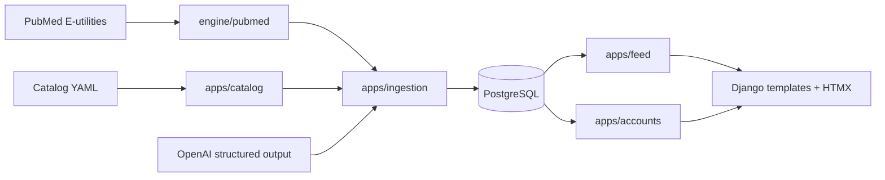
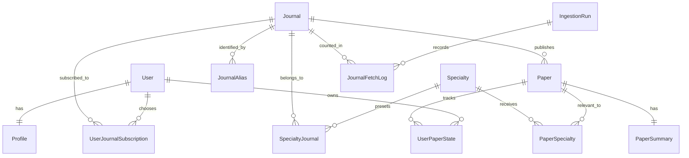

# Architecture

## System overview

MedPally is a Django server-rendered application backed by PostgreSQL. The deliberate boundary is `engine/`: it has no Django imports and owns integration-facing and algorithmic behaviour. Django apps own persistence, HTTP, forms, admin, and scheduled command entry points.

## Main modules

| Area | Responsibility |
|---|---|
| `engine/pubmed/` | Builds Entrez-date queries, calls E-utilities, and parses PubMed XML into `FetchedArticle`. |
| `engine/classify.py` | Assigns product categories, priority-study status, and RCT detection. |
| `engine/relevance.py` | Matches a general-journal paper against a specialty's MeSH/title/abstract vocabulary. |
| `engine/summarise/` | Builds the versioned prompt, validates structured output, and provides real/fake summarisers. |
| `apps/catalog/` | Holds specialties, journals, aliases, and YAML seeding/resolution commands. |
| `apps/papers/` | Holds source papers, generated notes, and specialty relevance links. |
| `apps/ingestion/` | Adapts engine data to database rows and runs the pipeline. |
| `apps/accounts/` | Email-based users, onboarding, journal choices, settings, OAuth, and legacy-subscriber prefill. |
| `apps/feed/` | Personalised feed queries, cursors, paper state, search, and paper actions. |
| `apps/common/` | Landing page, site context, and health endpoint. |

## Core data model

The model separates shared medical content from per-user state.

### Catalogue

- A `Journal` is the primary catalogue object. It stores display data, its PubMed search term, and stable identity values.
- A `Specialty` is a preset and relevance vocabulary, not a code branch.
- `SpecialtyJournal` selects journals by default for a specialty.
- `JournalAlias` maps every usable title, abbreviation, NLM ID, and ISSN to one canonical journal. Resolution favours electronic ISSN, print ISSN, NLM ID, MEDLINE abbreviation, title, then ISO abbreviation.

### Content and relevance

- `Paper` is one unique PubMed record, keyed by PMID. It stores the abstract only to generate notes; the web UI deliberately does not render it.
- `PaperSummary` is a one-to-one generated editorial note. Its model and prompt version allow a future prompt change to be selectively regenerated.
- `PaperSpecialty` records why a paper belongs in a specialty: `journal_scope` for a specialty journal or `topical_match` for a general journal.
- `feed_date` is normally the PubMed Entrez date. It is bumped when a paper gains its first late relevance link, so delayed MeSH indexing does not bury a newly relevant paper.

### Per-user behaviour

`UserPaperState` holds timestamps for first seen, opened, saved, liked, and dismissed. This makes the shared paper pool safe: a paper can be new to one clinician and already seen by another. Removed journal subscriptions are soft deactivated so reapplying a preset never restores a deliberate removal.

## Runtime behaviour

### Onboarding

The email-keyed custom user receives a `Profile` via signal. On first login, middleware makes onboarding resumable and non-skippable:

1. Set name, workplace, and specialty.
2. Confirm the specialty preset and customise journals.
3. Set preferred update frequency.

The stored frequency is preparatory data; MedPally currently updates the feed nightly and sends no digest email.

### Personalised feed

The feed is a database query, never a precomputed digest. It selects visible, successfully summarised papers from a user's active subscriptions. Papers from specialty journals are in scope automatically; papers from general journals must have a matching `PaperSpecialty` link for the user's specialty.

It uses keyset rather than offset pagination. The opaque cursor contains a paper's sort keys, protecting readers from duplicate or skipped cards when nightly inserts happen during scrolling. Seen papers remain visible but are de-emphasised; dismissed papers are hidden.

`/p/<pmid>/` is deliberately public and shows the generated note plus a link out to PubMed. It never exposes the stored abstract.

## Important invariants

- Search ingestion windows by PubMed **Entrez date** (`[edat]`), not publication date. Publication date is display-only and can be months apart.
- Do relevance matching at ingest and recheck time, not only in a PubMed query. Fresh papers often have no MeSH headings.
- Match journals by aliases and stable IDs, never title strings alone.
- Do not reset `feed_date`, `summary_status`, or `is_visible` during an ingest upsert.
- Do not reintroduce a fixed top-N summary cap as product behaviour; the configured cap is a per-run cost/budget control.
- Bump `engine/summarise/prompt.py:PROMPT_VERSION` whenever its prompt changes.
- Keep `engine/` Django-free and retain its strict type checking.

