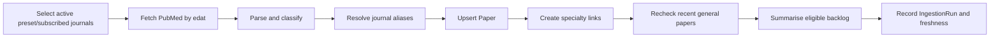

# Operations and maintenance runbook

## Nightly pipeline

The primary schedule is GitHub Actions at 02:00 UTC. An optional Render cron runs at 05:00 UTC as a catch-up. They are safe to run together: ingestion uses a PostgreSQL advisory lock, paper upserts are idempotent, and the default three-day lookback covers a missed night. A separate GitHub Actions workflow checks freshness at 12:00 UTC and alerts if no successful run exists within 36 hours.

## Routine commands

| Goal | Command |
|---|---|
| Seed/update YAML catalogue | `python manage.py seed_catalog` |
| Preview seed changes | `python manage.py seed_catalog --dry-run` |
| Resolve all unresolved journals | `python manage.py resolve_journals` |
| Resolve one journal | `python manage.py resolve_journals --slug <slug>` |
| Ingest, link, and summarise | `python manage.py ingest_papers` |
| Ingest without AI | `python manage.py ingest_papers --no-summaries` |
| Target a date range | `python manage.py ingest_papers --date-from YYYY-MM-DD --date-to YYYY-MM-DD` |
| Clear pending/failed summary backlog | `python manage.py summarise_papers --limit 100` |
| Recheck delayed relevance | `python manage.py recheck_relevance --days 90` |
| Backfill a new specialty | `python manage.py backfill_specialty <slug>` |
| Recompute changed RCT rules | `python manage.py reclassify_papers --days 90 --dry-run` |
| Check pipeline freshness | `python manage.py check_ingestion_freshness --max-age-hours 36` |

Use `uv run` before each command in a local checkout. The command examples omit it for readability.

## Adding or changing a specialty

1. Edit `apps/catalog/fixtures/catalog.yaml` to add/update a specialty, vocabulary, journals, and journal-to-specialty memberships.
2. Run `seed_catalog --dry-run`, inspect the result, then run `seed_catalog`.
3. For a new journal, run `resolve_journals --slug <slug>` and correct any PubMed term that yields zero results.
4. Run `backfill_specialty <slug>` to link existing papers without refetching.
5. Run `recheck_relevance` after material vocabulary changes if the specialty uses general journals.
6. Add fixtures and tests for new matching rules or catalogue behaviour.

Vocabulary supports a trailing `*` stem wildcard such as `cardi*`. It is matched as a word stem, while ordinary phrases use case-insensitive whole-phrase matching.

## Summary lifecycle

Papers with too little abstract text are marked `skipped`. Eligible papers are ranked priority studies first, then other priority papers, then standard papers. Each paper has at most three automatic summary attempts; failures are retained for inspection and can be retried with `summarise_papers`.

Generated summaries use OpenAI structured JSON output. The prompt text is product behaviour, copied from the legacy newsletter. Change it only with a prompt-version increment and an explicit plan to regenerate selected rows.

## Failure diagnosis

| Symptom | Checks and response |
|---|---|
| Feed is empty for everybody | Confirm migrations, `seed_catalog`, active journals, and a successful `IngestionRun`. Then inspect pending/skipped summary status. |
| Feed stopped growing | Run the freshness check; inspect `IngestionRun` and GitHub Actions. A failed or stale `running` row contains the command error. |
| A journal repeatedly returns zero | Inspect `JournalFetchLog`; run `resolve_journals --slug <slug> --force`. Fix the YAML `pubmed_name` if it does not return a real PubMed article. |
| Imported papers have no journal | Use the Papers admin “map unresolved journal” action. It writes the alias, repairs matching papers, and reruns specialty linking. |
| General-journal content is missing | Check specialty vocabulary and rerun `recheck_relevance`; delayed MeSH assignment is expected. |
| Summaries are stuck | Verify `OPENAI_API_KEY`, inspect `summary_error`/attempt count, and run `summarise_papers` after correcting configuration. |
| Health endpoint says stale | It reports freshness but stays HTTP-healthy by design. Fix the scheduler rather than cycling the web service. |

## Admin responsibilities

The Django admin is the operational interface for the catalogue and backlog:

- Review unresolved papers and map them to a canonical journal rather than guessing from a title in code.
- Use `is_visible` as the content kill switch.
- Review `IngestionRun` and `JournalFetchLog` after anomalies.
- Review catalogue aliases before creating a second journal row.

## Deployment notes

Production uses Supabase PostgreSQL through its **session** pooler on port 5432, not the transaction pooler on 6543. The latter conflicts with migrations and server-side cursors. `DB_CONN_MAX_AGE=0` is intentional: a persistent connection would occupy a limited session-pool slot for its entire lifetime.

The full Render, GitHub Actions, Google OAuth, SMTP, and post-deploy procedure is in [DEPLOY.md](DEPLOY.md).

